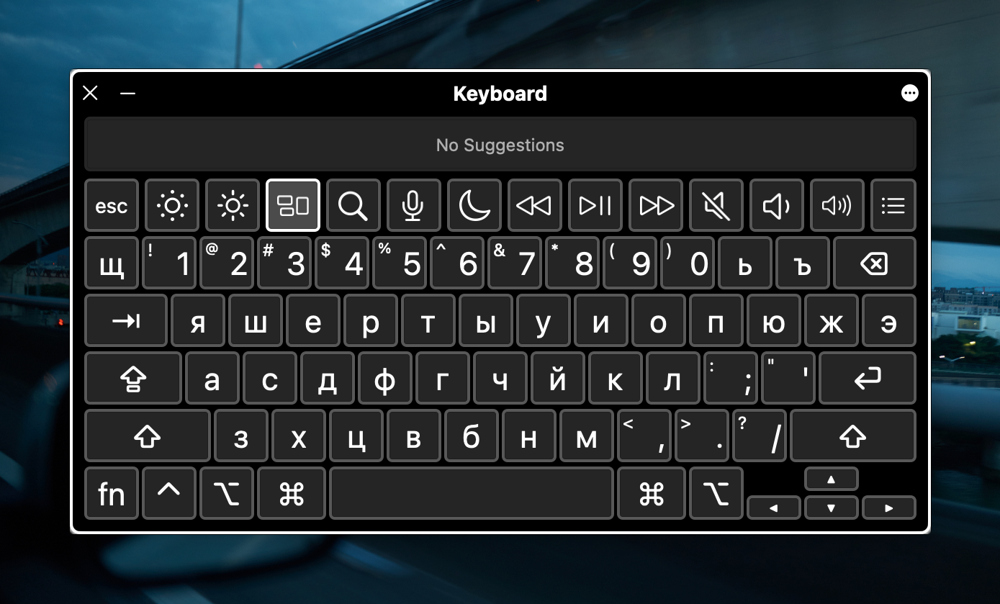

# Russian QWERTY input method for Emacs/Quail

This is a package defining the Russian - QWERTY (aka ЯШЕРТЫ) input mode for [Quail](https://github.com/jwiegley/emacs-release/blob/master/lisp/international/quail.el), which is the built-in Emacs input mode maanger.

The Russian QWERTY input method is based on the macOS input method of the same name (which used to be called “Russian Phonetic”):

As a Russian kid growing up in Europe, I never learned to type on the “normal” ЙЦУКЕН layout, and this layout has been a useful convenience for me. It is my hope that it might help someone else in this situation!

## Instructions

Install the package or evaluate `quail-russian-qwerty.el`, and the `russian-qwerty` input method will be available to select via `M-x set-input-method`.

## Contributing

If you notice any problems, please open an issue on the issue tracker. Alternatively, please feel free to [email me](mailto:mail@gosha.net) or find me [on Twitter](https://twitter.com/goshatch).

## License

This program is free software: you can redistribute it and/or modify it under the terms of the GNU General Public License as published by the Free Software Foundation, either version 3 of the License, or (at your option) any later version.

This program is distributed in the hope that it will be useful, but WITHOUT ANY WARRANTY; without even the implied warranty of MERCHANTABILITY or FITNESS FOR A PARTICULAR PURPOSE. See the GNU General Public License for more details.

You should have received a copy of the GNU General Public License along with this program. If not, see <https://www.gnu.org/licenses/>.
